# Data Flow Design

This document details how data flows through the NutriCoach v2 system, including real-time operations, background processing, and data synchronization patterns.

## Core Data Flows

### User Registration Flow

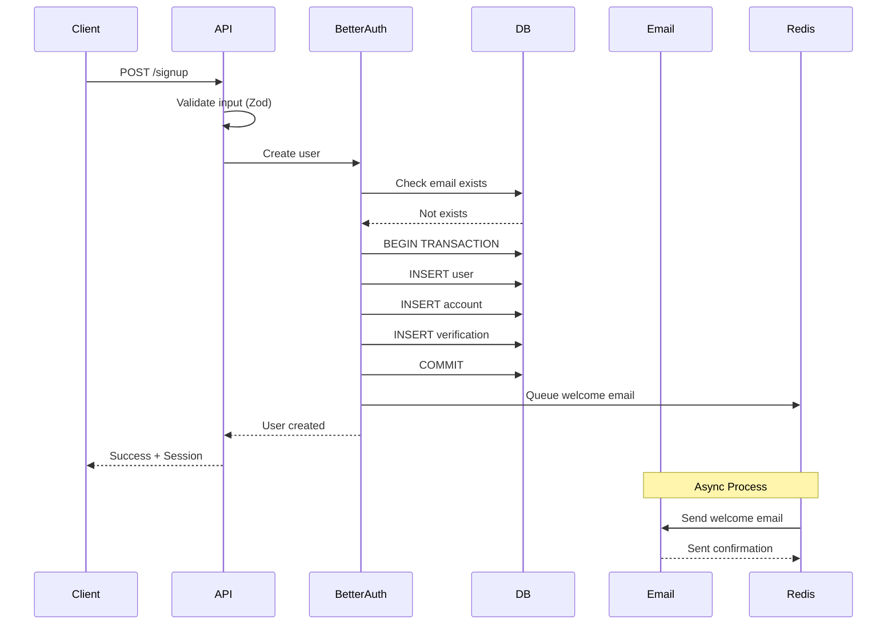

### Meal Creation with AI Flow

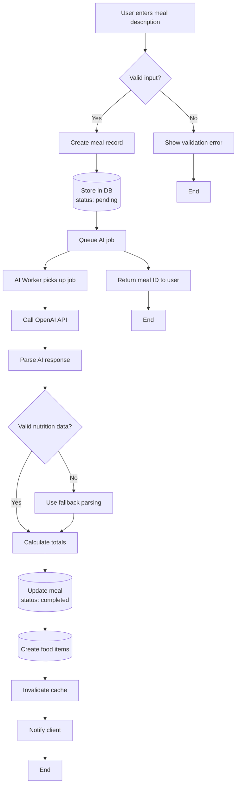

### Real-time Data Synchronization

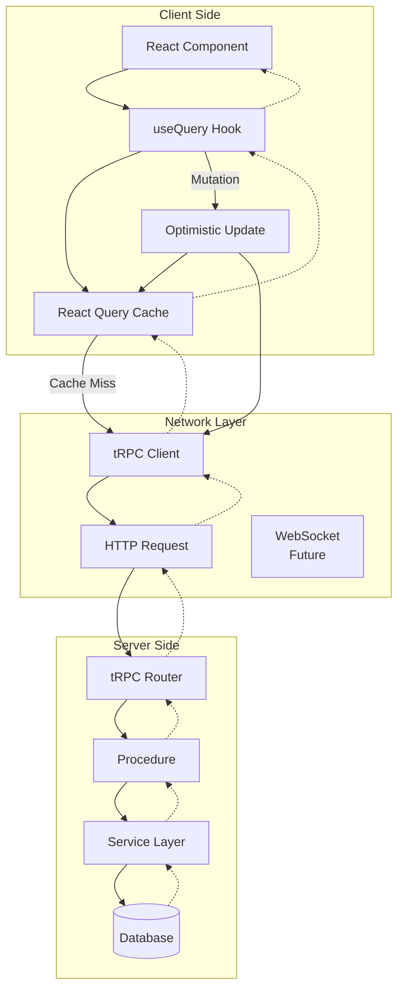

### Daily Summary Generation Flow

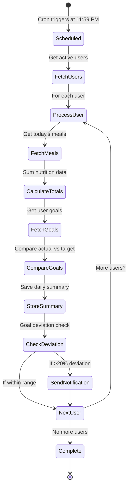

## Data Transformation Flows

### Input Validation Pipeline

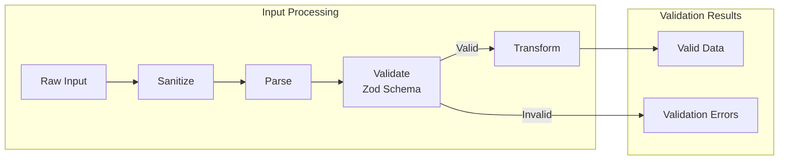

### Nutrition Calculation Flow

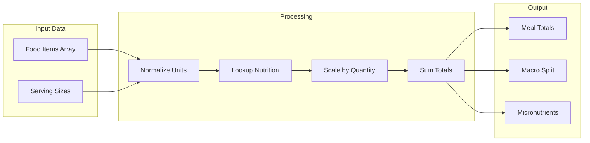

## Caching Strategy

### Multi-Level Cache Flow

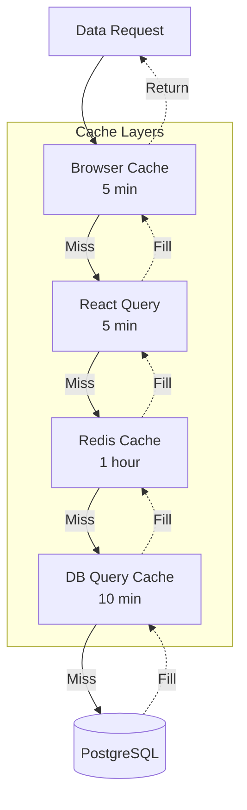

### Cache Invalidation Strategy

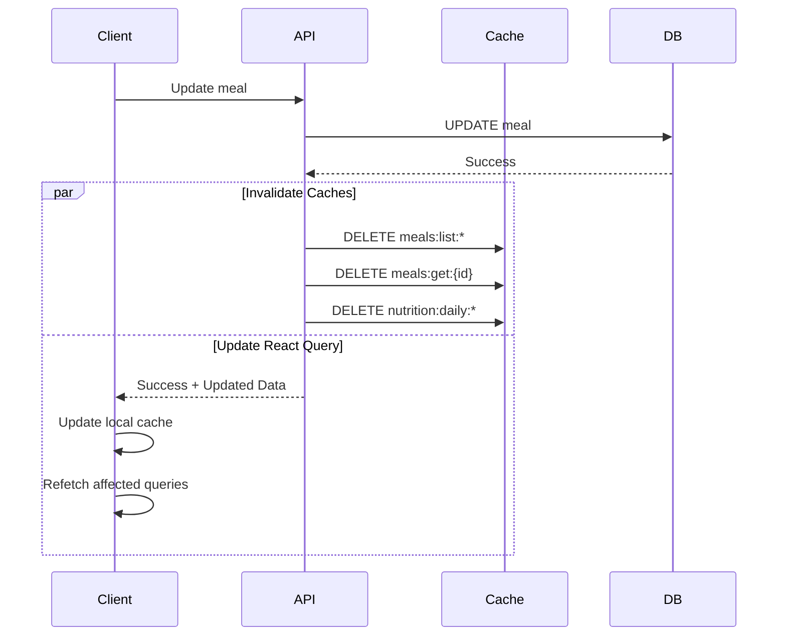

## Error Handling Flows

### Retry Logic with Exponential Backoff

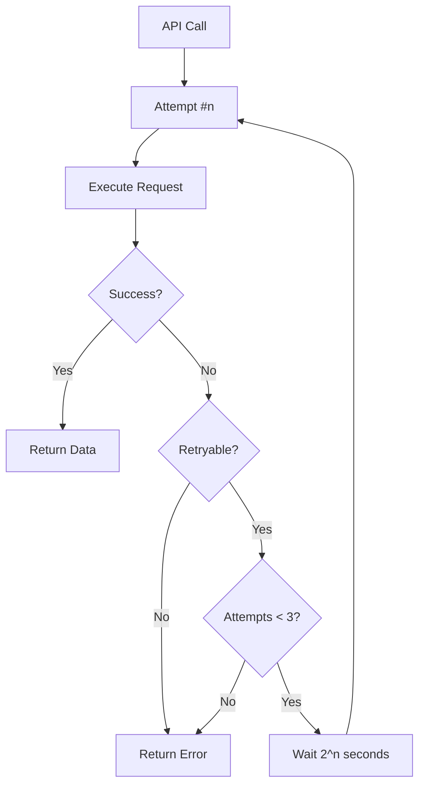

### Error Recovery Flow

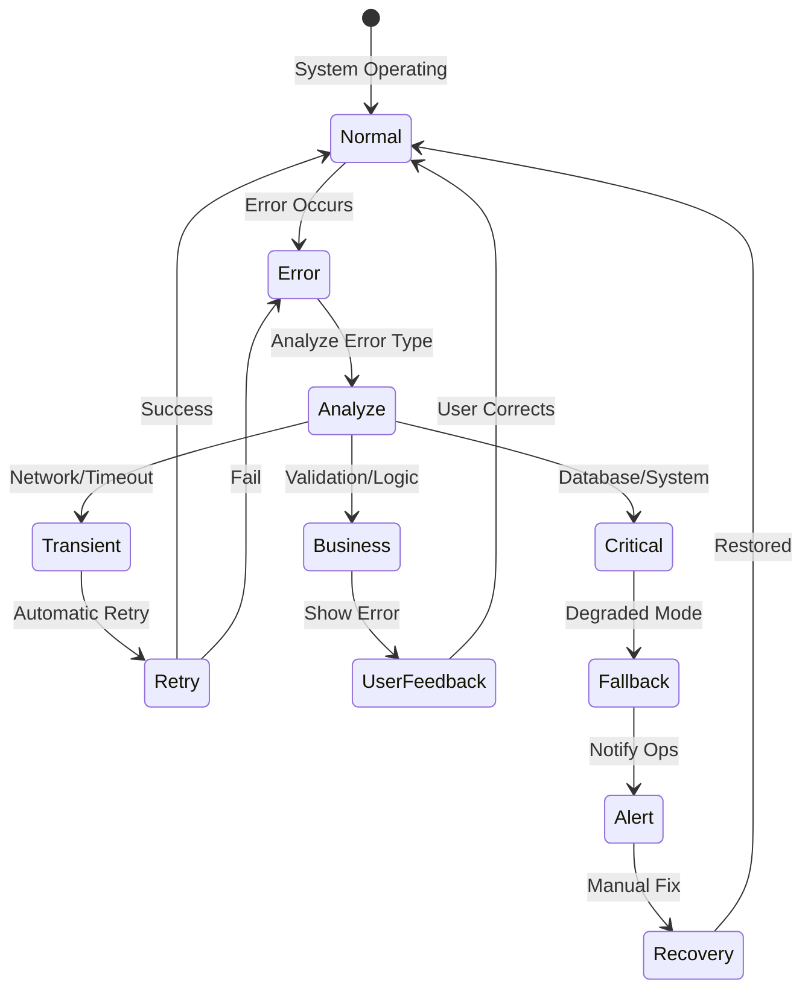

## Background Job Processing

### Job Queue Flow

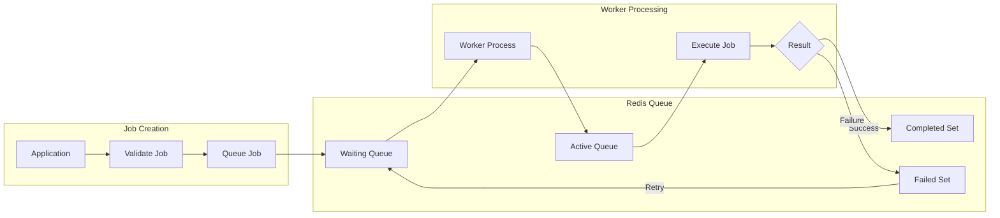

### Distributed Job Processing

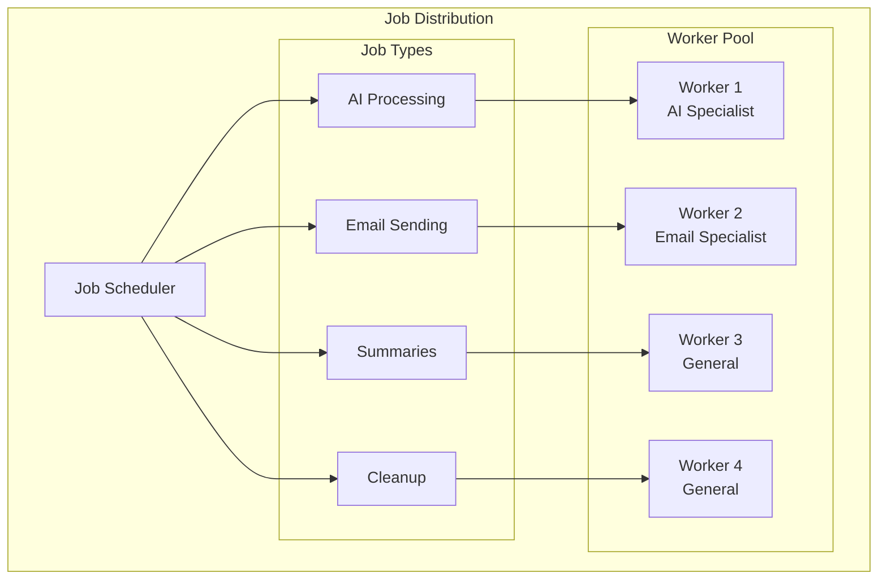

## Data Security Flows

### Authentication Token Flow

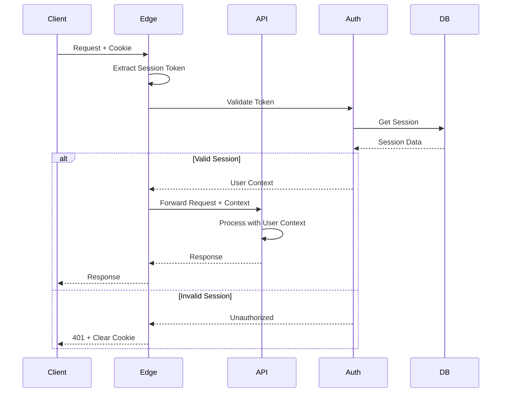

### Row-Level Security Flow

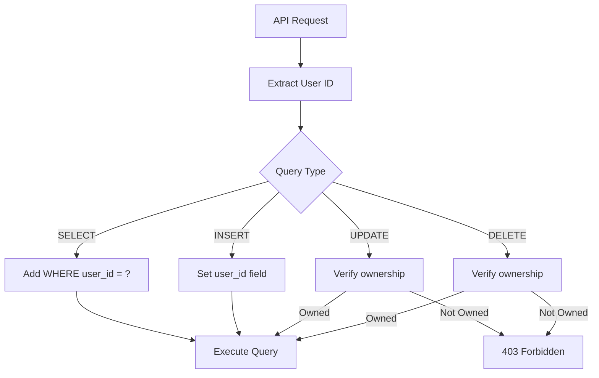

## Performance Optimization Flows

### Query Optimization

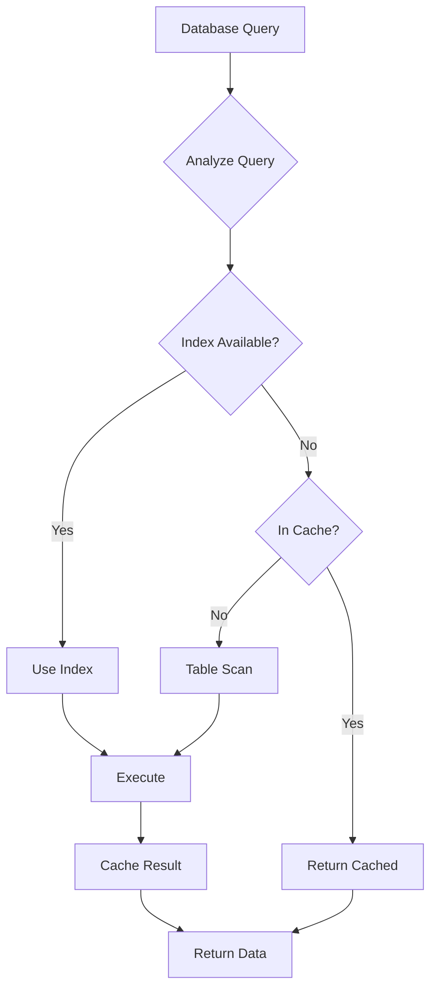

### Batch Processing Flow

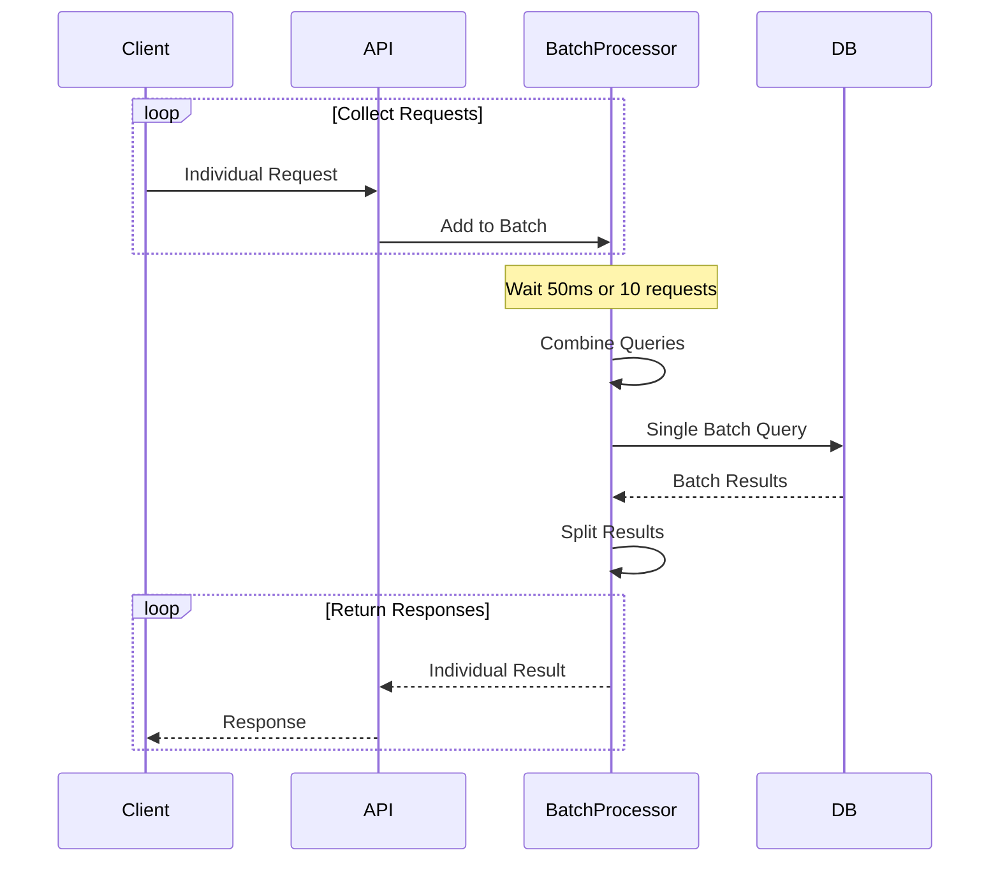

## Monitoring Data Flow

### Metrics Collection

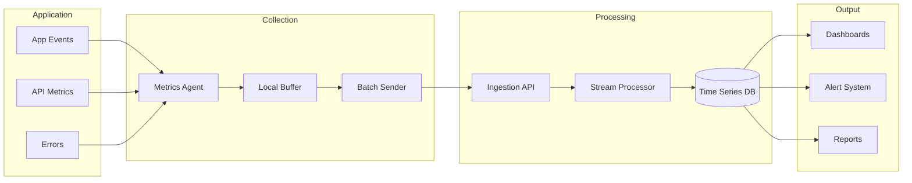

## Data Migration Flows

### Schema Migration

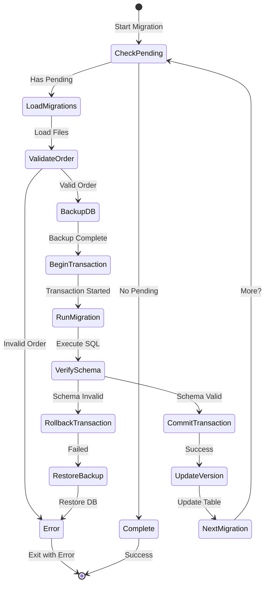

This comprehensive data flow design ensures efficient, secure, and reliable data handling throughout the NutriCoach v2 system.
