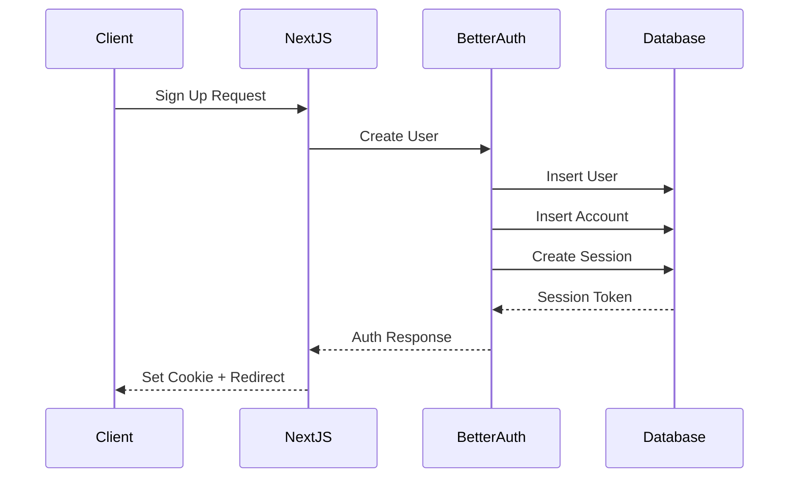
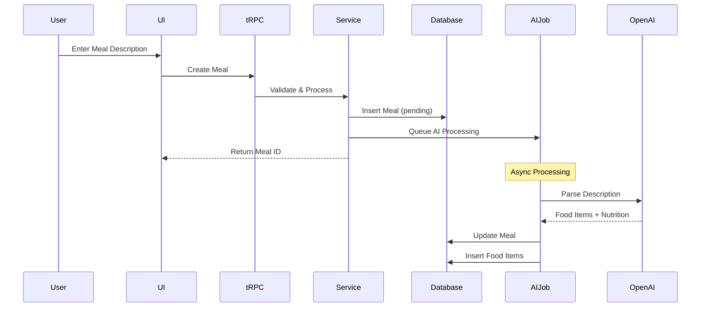
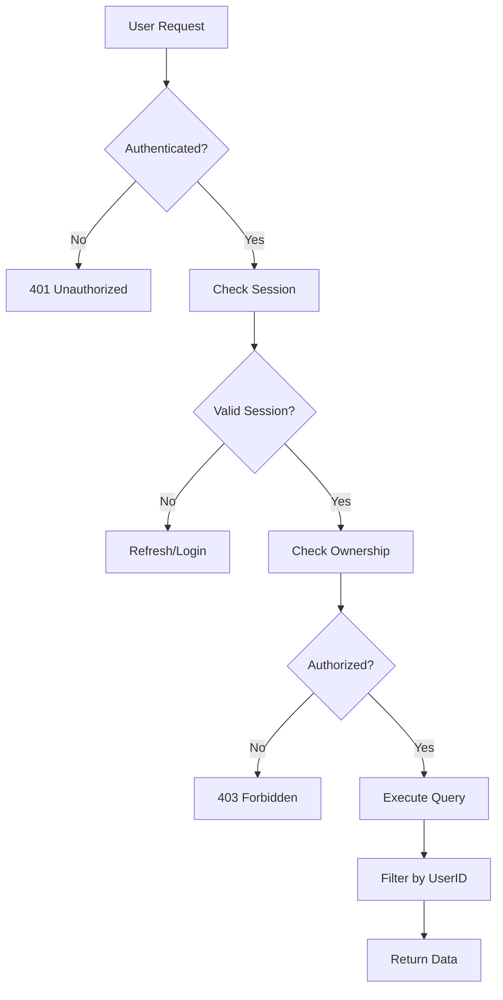

# Database Design Document

This document provides a comprehensive overview of the NutriCoach v2 database design, including all Better Auth tables and application-specific tables. The design uses PostgreSQL with Drizzle ORM for type-safe database interactions.

## Overview

The database is designed around two main domains:
1. **Authentication & User Management** - Powered by Better Auth v1.2.9
2. **Nutrition & Meal Tracking** - Application-specific functionality

## Entity Relationship Diagram

```mermaid
erDiagram
    %% Better Auth Core Tables
    user {
        string id PK
        string name
        string email UK
        boolean emailVerified
        string image
        timestamp createdAt
        timestamp updatedAt
        boolean twoFactorEnabled
        string role
        boolean banned
        string banReason
        timestamp banExpires
    }

    session {
        string id PK
        timestamp expiresAt
        string token UK
        timestamp createdAt
        timestamp updatedAt
        string ipAddress
        string userAgent
        string userId FK
        string activeOrganizationId FK
        string impersonatedBy FK
    }

    account {
        string id PK
        string accountId
        string providerId
        string userId FK
        string accessToken
        string refreshToken
        string idToken
        timestamp accessTokenExpiresAt
        timestamp refreshTokenExpiresAt
        string scope
        string password
        timestamp createdAt
        timestamp updatedAt
    }

    verification {
        string id PK
        string identifier
        string value
        timestamp expiresAt
        timestamp createdAt
        timestamp updatedAt
    }

    %% Two-Factor Authentication
    twoFactor {
        string id PK
        string userId FK
        string secret
        string backupCodes
        timestamp createdAt
        timestamp updatedAt
    }

    %% Passkey Authentication
    passkey {
        string id PK
        string name
        string publicKey
        string userId FK
        string credentialID
        number counter
        string deviceType
        boolean backedUp
        string transports
        timestamp createdAt
        string aaguid
    }

    %% API Key Management
    apiKey {
        string id PK
        string name
        string start
        string prefix
        string key
        string userId FK
        number refillInterval
        number refillAmount
        timestamp lastRefillAt
        boolean enabled
        boolean rateLimitEnabled
        number rateLimitTimeWindow
        number rateLimitMax
        number requestCount
        number remaining
        timestamp lastRequest
        timestamp expiresAt
        timestamp createdAt
        timestamp updatedAt
        string permissions
        json metadata
    }

    %% Organization Management
    organization {
        string id PK
        string name
        string slug UK
        string logo
        string metadata
        timestamp createdAt
        timestamp updatedAt
    }

    member {
        string id PK
        string userId FK
        string organizationId FK
        string teamId FK
        string role
        timestamp createdAt
        timestamp updatedAt
    }

    team {
        string id PK
        string name
        string organizationId FK
        timestamp createdAt
        timestamp updatedAt
    }

    invitation {
        string id PK
        string email
        string inviterId FK
        string organizationId FK
        string teamId FK
        string role
        string status
        timestamp expiresAt
        timestamp createdAt
    }

    %% NutriCoach Specific Tables
    userProfile {
        string id PK
        string userId FK UK
        integer age
        string gender
        decimal height
        decimal weight
        string activityLevel
        array dietaryRestrictions
        timestamp createdAt
        timestamp updatedAt
    }

    goal {
        string id PK
        string userId FK
        string type
        decimal targetWeight
        timestamp targetDate
        integer dailyCalories
        integer dailyProtein
        integer dailyCarbs
        integer dailyFat
        boolean active
        timestamp createdAt
        timestamp updatedAt
    }

    meal {
        string id PK
        string userId FK
        string name
        string description
        string type
        timestamp loggedAt
        integer totalCalories
        decimal totalProtein
        decimal totalCarbs
        decimal totalFat
        decimal totalFiber
        boolean aiParsed
        timestamp createdAt
        timestamp updatedAt
    }

    foodItem {
        string id PK
        string mealId FK
        string name
        string brand
        decimal quantity
        string unit
        integer calories
        decimal protein
        decimal carbs
        decimal fat
        decimal fiber
        decimal sodium
        decimal sugar
        timestamp createdAt
        timestamp updatedAt
    }

    weightEntry {
        string id PK
        string userId FK
        decimal weight
        timestamp loggedAt
        string notes
        timestamp createdAt
    }

    dailySummary {
        string id PK
        string userId FK
        date date UK
        integer totalCalories
        decimal totalProtein
        decimal totalCarbs
        decimal totalFat
        decimal totalFiber
        integer mealCount
        integer goalCalories
        integer goalProtein
        integer goalCarbs
        integer goalFat
        timestamp createdAt
    }

    %% Relationships
    user ||--o{ session : "has"
    user ||--o{ account : "has"
    user ||--o{ twoFactor : "has"
    user ||--o{ passkey : "has"
    user ||--o{ apiKey : "owns"
    user ||--o| userProfile : "has"
    user ||--o{ goal : "sets"
    user ||--o{ meal : "logs"
    user ||--o{ weightEntry : "records"
    user ||--o{ dailySummary : "has"
    user ||--o{ member : "belongs to"
    user ||--o{ invitation : "invited by"
    
    organization ||--o{ member : "has"
    organization ||--o{ team : "contains"
    organization ||--o{ invitation : "sends"
    
    team ||--o{ member : "has"
    team ||--o{ invitation : "for"
    
    meal ||--o{ foodItem : "contains"
    
    session ||--o| organization : "active in"
    session ||--o| user : "impersonated by"
```

## Table Definitions

### Better Auth Core Tables

#### User Table
```sql
CREATE TABLE "user" (
    id TEXT PRIMARY KEY,
    name TEXT NOT NULL,
    email TEXT NOT NULL UNIQUE,
    email_verified BOOLEAN NOT NULL DEFAULT FALSE,
    image TEXT,
    created_at TIMESTAMP NOT NULL DEFAULT NOW(),
    updated_at TIMESTAMP NOT NULL DEFAULT NOW(),
    -- Plugin fields
    two_factor_enabled BOOLEAN,
    role TEXT DEFAULT 'user',
    banned BOOLEAN DEFAULT FALSE,
    ban_reason TEXT,
    ban_expires TIMESTAMP
);

CREATE INDEX idx_user_email ON "user"(email);
```

#### Session Table
```sql
CREATE TABLE session (
    id TEXT PRIMARY KEY,
    expires_at TIMESTAMP NOT NULL,
    token TEXT NOT NULL UNIQUE,
    created_at TIMESTAMP NOT NULL DEFAULT NOW(),
    updated_at TIMESTAMP NOT NULL DEFAULT NOW(),
    ip_address TEXT,
    user_agent TEXT,
    user_id TEXT NOT NULL REFERENCES "user"(id) ON DELETE CASCADE,
    -- Organization plugin
    active_organization_id TEXT REFERENCES organization(id),
    -- Admin plugin
    impersonated_by TEXT REFERENCES "user"(id)
);

CREATE INDEX idx_session_user_id ON session(user_id);
CREATE INDEX idx_session_token ON session(token);
```

#### Account Table
```sql
CREATE TABLE account (
    id TEXT PRIMARY KEY,
    account_id TEXT NOT NULL,
    provider_id TEXT NOT NULL,
    user_id TEXT NOT NULL REFERENCES "user"(id) ON DELETE CASCADE,
    access_token TEXT,
    refresh_token TEXT,
    id_token TEXT,
    access_token_expires_at TIMESTAMP,
    refresh_token_expires_at TIMESTAMP,
    scope TEXT,
    password TEXT,
    created_at TIMESTAMP NOT NULL DEFAULT NOW(),
    updated_at TIMESTAMP NOT NULL DEFAULT NOW(),
    UNIQUE(account_id, provider_id)
);

CREATE INDEX idx_account_user_id ON account(user_id);
```

### Two-Factor Authentication
```sql
CREATE TABLE two_factor (
    id TEXT PRIMARY KEY,
    user_id TEXT NOT NULL REFERENCES "user"(id) ON DELETE CASCADE,
    secret TEXT,
    backup_codes TEXT,
    created_at TIMESTAMP NOT NULL DEFAULT NOW(),
    updated_at TIMESTAMP NOT NULL DEFAULT NOW()
);

CREATE INDEX idx_two_factor_user_id ON two_factor(user_id);
```

### API Key Management
```sql
CREATE TABLE api_key (
    id TEXT PRIMARY KEY,
    name TEXT,
    start TEXT,
    prefix TEXT,
    key TEXT NOT NULL,
    user_id TEXT NOT NULL REFERENCES "user"(id) ON DELETE CASCADE,
    refill_interval INTEGER,
    refill_amount INTEGER,
    last_refill_at TIMESTAMP,
    enabled BOOLEAN NOT NULL DEFAULT TRUE,
    rate_limit_enabled BOOLEAN NOT NULL DEFAULT FALSE,
    rate_limit_time_window INTEGER,
    rate_limit_max INTEGER,
    request_count INTEGER NOT NULL DEFAULT 0,
    remaining INTEGER,
    last_request TIMESTAMP,
    expires_at TIMESTAMP,
    created_at TIMESTAMP NOT NULL DEFAULT NOW(),
    updated_at TIMESTAMP NOT NULL DEFAULT NOW(),
    permissions TEXT,
    metadata JSONB
);

CREATE INDEX idx_api_key_user_id ON api_key(user_id);
CREATE INDEX idx_api_key_prefix ON api_key(prefix);
```

### Organization Management
```sql
CREATE TABLE organization (
    id TEXT PRIMARY KEY,
    name TEXT NOT NULL,
    slug TEXT NOT NULL UNIQUE,
    logo TEXT,
    metadata TEXT,
    created_at TIMESTAMP NOT NULL DEFAULT NOW(),
    updated_at TIMESTAMP NOT NULL DEFAULT NOW()
);

CREATE INDEX idx_organization_slug ON organization(slug);

CREATE TABLE member (
    id TEXT PRIMARY KEY,
    user_id TEXT NOT NULL REFERENCES "user"(id) ON DELETE CASCADE,
    organization_id TEXT NOT NULL REFERENCES organization(id) ON DELETE CASCADE,
    team_id TEXT REFERENCES team(id),
    role TEXT NOT NULL DEFAULT 'member',
    created_at TIMESTAMP NOT NULL DEFAULT NOW(),
    updated_at TIMESTAMP NOT NULL DEFAULT NOW(),
    UNIQUE(user_id, organization_id)
);

CREATE INDEX idx_member_user_id ON member(user_id);
CREATE INDEX idx_member_organization_id ON member(organization_id);
```

### NutriCoach Application Tables

#### User Profile
```sql
CREATE TABLE user_profile (
    id TEXT PRIMARY KEY,
    user_id TEXT NOT NULL UNIQUE REFERENCES "user"(id) ON DELETE CASCADE,
    age INTEGER CHECK (age > 0 AND age < 150),
    gender TEXT CHECK (gender IN ('male', 'female', 'other', 'prefer_not_to_say')),
    height DECIMAL(5,2) CHECK (height > 0), -- in cm
    weight DECIMAL(5,2) CHECK (weight > 0), -- in kg
    activity_level TEXT CHECK (activity_level IN (
        'sedentary', 'lightly_active', 'moderately_active', 
        'very_active', 'extra_active'
    )),
    dietary_restrictions TEXT[],
    created_at TIMESTAMP NOT NULL DEFAULT NOW(),
    updated_at TIMESTAMP NOT NULL DEFAULT NOW()
);
```

#### Goals
```sql
CREATE TABLE goal (
    id TEXT PRIMARY KEY,
    user_id TEXT NOT NULL REFERENCES "user"(id) ON DELETE CASCADE,
    type TEXT NOT NULL CHECK (type IN (
        'weight_loss', 'weight_gain', 'maintain', 'muscle_gain'
    )),
    target_weight DECIMAL(5,2),
    target_date TIMESTAMP,
    daily_calories INTEGER CHECK (daily_calories > 0),
    daily_protein INTEGER CHECK (daily_protein >= 0),
    daily_carbs INTEGER CHECK (daily_carbs >= 0),
    daily_fat INTEGER CHECK (daily_fat >= 0),
    active BOOLEAN NOT NULL DEFAULT TRUE,
    created_at TIMESTAMP NOT NULL DEFAULT NOW(),
    updated_at TIMESTAMP NOT NULL DEFAULT NOW()
);

CREATE INDEX idx_goal_user_id_active ON goal(user_id, active);
```

#### Meals
```sql
CREATE TABLE meal (
    id TEXT PRIMARY KEY,
    user_id TEXT NOT NULL REFERENCES "user"(id) ON DELETE CASCADE,
    name TEXT NOT NULL,
    description TEXT,
    type TEXT CHECK (type IN ('breakfast', 'lunch', 'dinner', 'snack')),
    logged_at TIMESTAMP NOT NULL DEFAULT NOW(),
    total_calories INTEGER,
    total_protein DECIMAL(8,2),
    total_carbs DECIMAL(8,2),
    total_fat DECIMAL(8,2),
    total_fiber DECIMAL(8,2),
    ai_parsed BOOLEAN NOT NULL DEFAULT FALSE,
    created_at TIMESTAMP NOT NULL DEFAULT NOW(),
    updated_at TIMESTAMP NOT NULL DEFAULT NOW()
);

CREATE INDEX idx_meal_user_id ON meal(user_id);
CREATE INDEX idx_meal_logged_at ON meal(user_id, logged_at DESC);
```

#### Food Items
```sql
CREATE TABLE food_item (
    id TEXT PRIMARY KEY,
    meal_id TEXT NOT NULL REFERENCES meal(id) ON DELETE CASCADE,
    name TEXT NOT NULL,
    brand TEXT,
    quantity DECIMAL(8,2) NOT NULL CHECK (quantity > 0),
    unit TEXT NOT NULL,
    calories INTEGER,
    protein DECIMAL(8,2),
    carbs DECIMAL(8,2),
    fat DECIMAL(8,2),
    fiber DECIMAL(8,2),
    sodium DECIMAL(8,2),
    sugar DECIMAL(8,2),
    created_at TIMESTAMP NOT NULL DEFAULT NOW(),
    updated_at TIMESTAMP NOT NULL DEFAULT NOW()
);

CREATE INDEX idx_food_item_meal_id ON food_item(meal_id);
```

## Data Flow Diagrams

### Authentication Flow


### Meal Logging Flow


## Security Considerations

### Data Access Patterns


### Key Security Features

1. **Row-Level Security**
   - All queries filtered by user_id
   - Ownership verification before updates/deletes
   - Organization-based access control

2. **Authentication Security**
   - Passwords hashed with bcrypt
   - Sessions stored server-side
   - CSRF protection built-in
   - Rate limiting on auth endpoints

3. **Data Encryption**
   - Sensitive fields encrypted at rest
   - TLS for data in transit
   - Secure cookie settings

## Performance Optimizations

### Indexes
```sql
-- Authentication Performance
CREATE INDEX idx_user_email ON "user"(email);
CREATE INDEX idx_session_token ON session(token);
CREATE INDEX idx_session_user_id ON session(user_id);
CREATE INDEX idx_account_user_id ON account(user_id);

-- Application Performance
CREATE INDEX idx_meal_user_logged ON meal(user_id, logged_at DESC);
CREATE INDEX idx_food_item_meal ON food_item(meal_id);
CREATE INDEX idx_daily_summary_user_date ON daily_summary(user_id, date);
CREATE INDEX idx_goal_user_active ON goal(user_id, active);
```

### Query Optimization Patterns

1. **Batch Loading**
   ```sql
   -- Load meals with food items in single query
   SELECT m.*, 
          json_agg(f.*) as food_items
   FROM meal m
   LEFT JOIN food_item f ON f.meal_id = m.id
   WHERE m.user_id = $1
   GROUP BY m.id
   ORDER BY m.logged_at DESC
   LIMIT 20;
   ```

2. **Aggregation Views**
   ```sql
   -- Materialized view for daily stats
   CREATE MATERIALIZED VIEW daily_nutrition_stats AS
   SELECT 
       user_id,
       DATE(logged_at) as date,
       SUM(total_calories) as daily_calories,
       SUM(total_protein) as daily_protein,
       SUM(total_carbs) as daily_carbs,
       SUM(total_fat) as daily_fat,
       COUNT(*) as meal_count
   FROM meal
   GROUP BY user_id, DATE(logged_at);
   
   CREATE INDEX idx_daily_stats ON daily_nutrition_stats(user_id, date);
   ```

## Migration Strategy

### Version Control
```sql
-- migrations/001_initial_schema.sql
-- Better Auth core tables

-- migrations/002_nutricoach_tables.sql  
-- Application-specific tables

-- migrations/003_add_indexes.sql
-- Performance indexes

-- migrations/004_add_constraints.sql
-- Additional constraints and checks
```

### Rollback Procedures
1. Each migration must have a corresponding rollback script
2. Test rollbacks in staging before production
3. Backup database before major migrations
4. Use transactions for multi-table changes

## Backup and Recovery

### Backup Strategy
- **Continuous Backups**: Point-in-time recovery enabled
- **Daily Snapshots**: Full database backup at 3 AM UTC
- **Weekly Archives**: Long-term storage for compliance
- **Geo-Redundancy**: Backups stored in multiple regions

### Recovery Procedures
1. **Point-in-Time Recovery**: Restore to any point within retention window
2. **Snapshot Restoration**: Full database restore from daily backups
3. **Selective Recovery**: Table-level restoration for specific data
4. **Disaster Recovery**: Cross-region failover capabilities

## Monitoring and Maintenance

### Key Metrics
- Query performance (p95, p99)
- Connection pool utilization
- Table growth rates
- Index effectiveness
- Cache hit ratios

### Maintenance Tasks
- Weekly VACUUM ANALYZE
- Monthly index rebuilding
- Quarterly partition management
- Annual data archival

## Future Considerations

### Scalability
- Horizontal sharding by user_id
- Read replicas for analytics
- Partitioning for time-series data
- Caching layer (Redis) integration

### Feature Expansions
- Social features (following, sharing)
- Restaurant menu integration
- Barcode scanning data
- Wearable device sync
- AI meal recommendations