# System Architecture Design

This document provides a comprehensive overview of the NutriCoach v2 system architecture, including all components, data flows, and integration points.

## High-Level Architecture

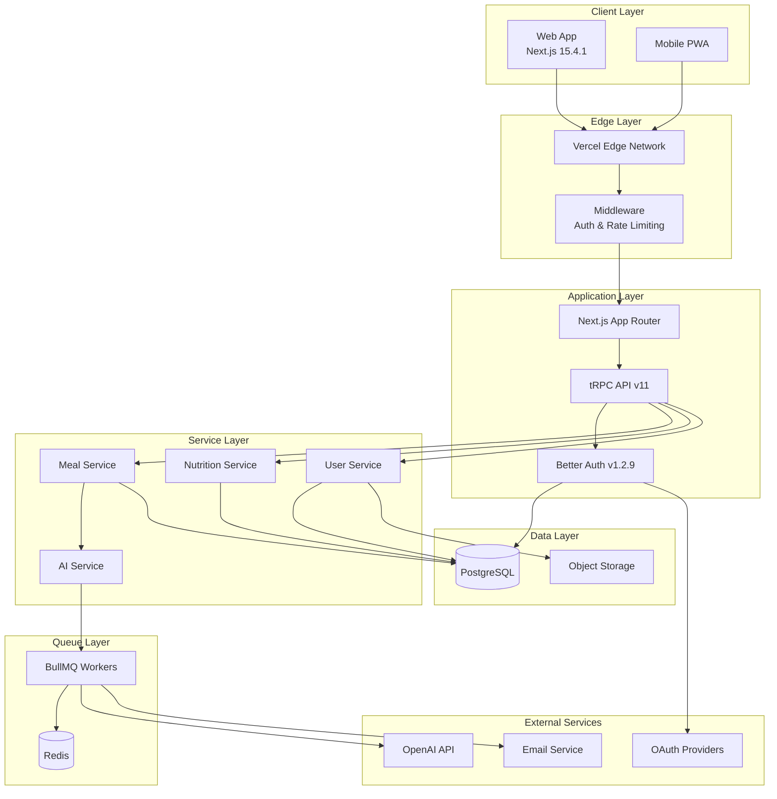

## Component Architecture

### Frontend Architecture

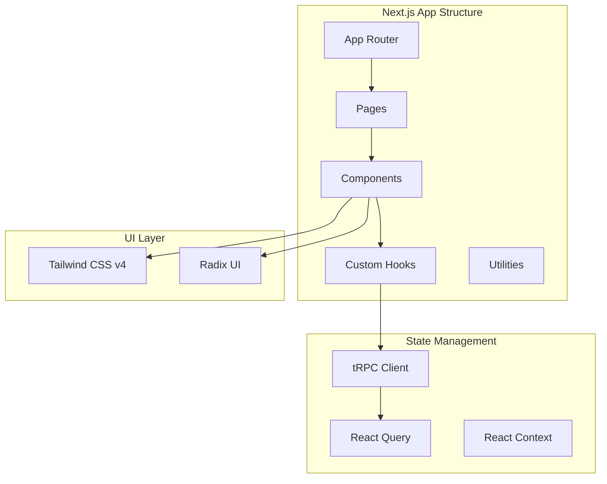

### Backend Architecture

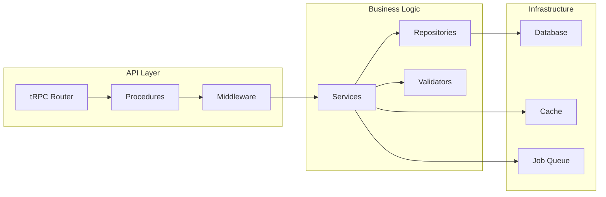

## Authentication Flow

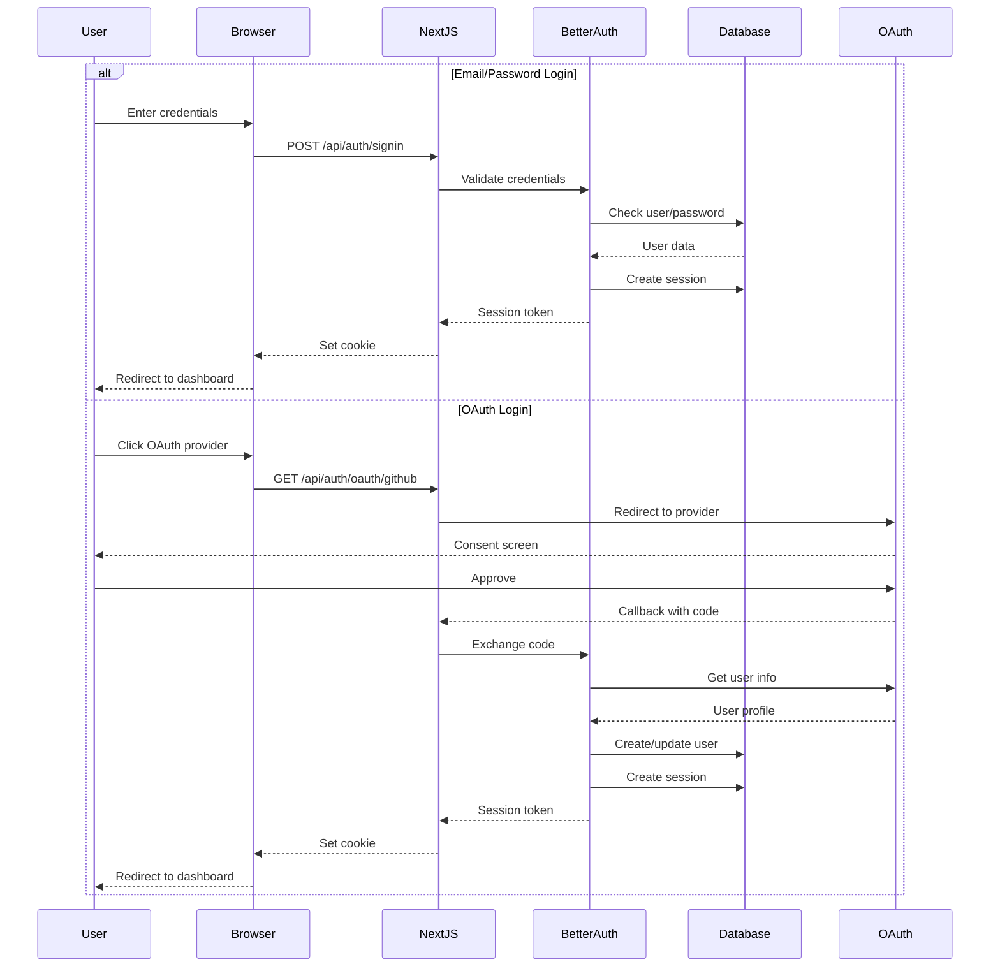

## Data Flow Architecture

### Real-time Data Flow

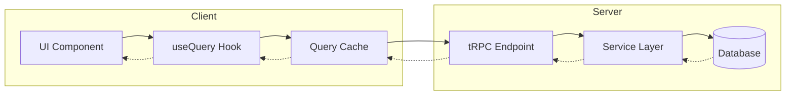

### Background Job Processing

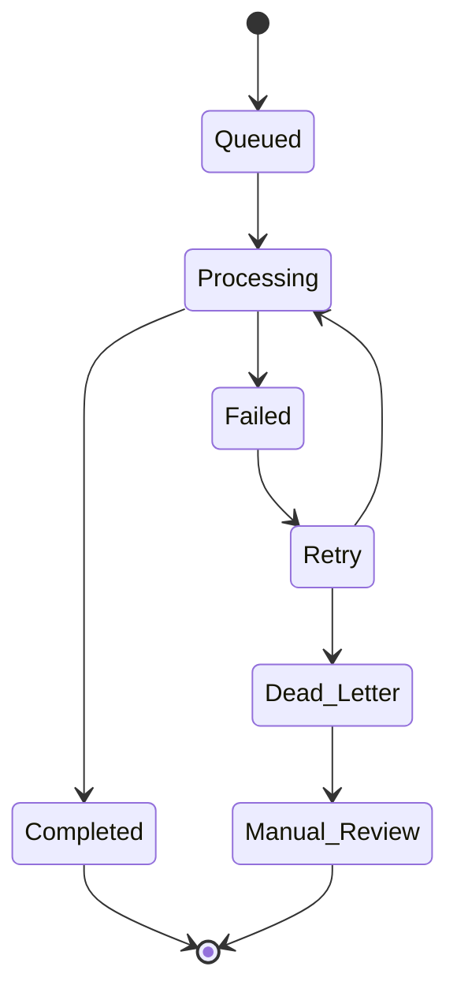

## Deployment Architecture

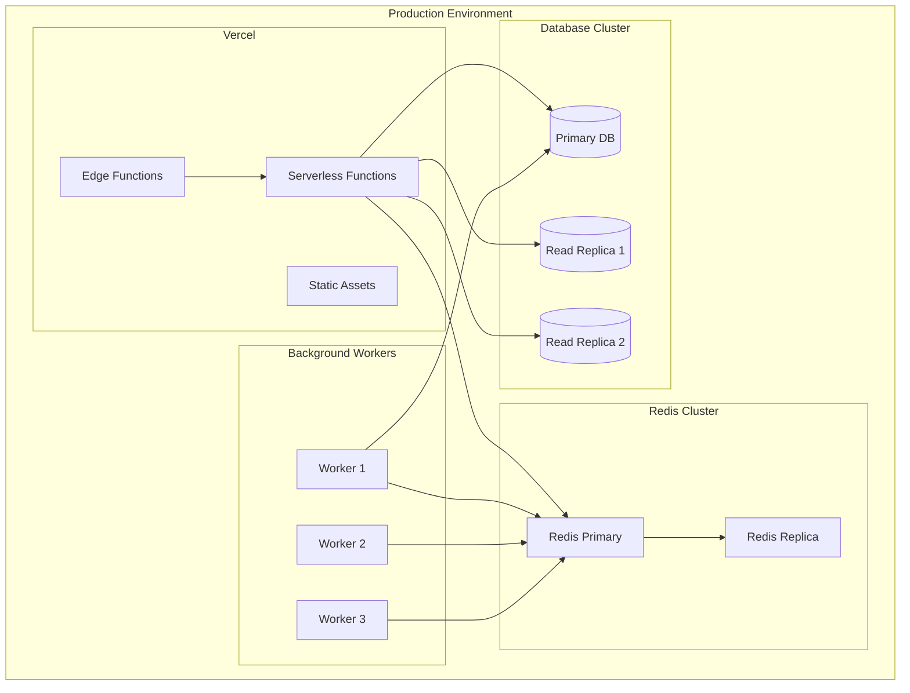

## Security Architecture

```mermaid
graph TD
    subgraph "Security Layers"
        WAF[Web Application Firewall]
        DDOS[DDoS Protection]
        SSL[SSL/TLS Termination]
        
        subgraph "Application Security"
            AUTH_MW[Auth Middleware]
            RATE[Rate Limiting]
            CSRF[CSRF Protection]
            CSP[Content Security Policy]
        end
        
        subgraph "Data Security"
            ENCRYPT[Encryption at Rest]
            ROW_SEC[Row Level Security]
            AUDIT[Audit Logging]
        end
    end
    
    WAF --> DDOS
    DDOS --> SSL
    SSL --> AUTH_MW
    AUTH_MW --> RATE
    RATE --> CSRF
    CSRF --> CSP
    CSP --> ENCRYPT
    ENCRYPT --> ROW_SEC
    ROW_SEC --> AUDIT
```

## Module Architecture

```mermaid
graph TD
    subgraph "Feature Modules"
        subgraph "Auth Module"
            AUTH_ROUTER[Router]
            AUTH_SERVICE[Service]
            AUTH_UI[UI Components]
        end
        
        subgraph "Meals Module"
            MEAL_ROUTER[Router]
            MEAL_SERVICE[Service]
            MEAL_REPO[Repository]
            MEAL_UI[UI Components]
        end
        
        subgraph "Nutrition Module"
            NUTR_ROUTER[Router]
            NUTR_SERVICE[Service]
            NUTR_CALC[Calculator]
            NUTR_UI[UI Components]
        end
        
        subgraph "User Module"
            USER_ROUTER[Router]
            USER_SERVICE[Service]
            USER_REPO[Repository]
            USER_UI[UI Components]
        end
    end
    
    subgraph "Shared Infrastructure"
        SHARED_DB[Database]
        SHARED_CACHE[Cache]
        SHARED_QUEUE[Queue]
        SHARED_UTILS[Utilities]
    end
    
    AUTH_SERVICE --> SHARED_DB
    MEAL_SERVICE --> SHARED_DB
    NUTR_SERVICE --> SHARED_CACHE
    USER_SERVICE --> SHARED_DB
    MEAL_SERVICE --> SHARED_QUEUE
```

## Performance Architecture

### Caching Strategy

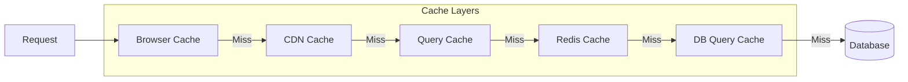

### Load Balancing

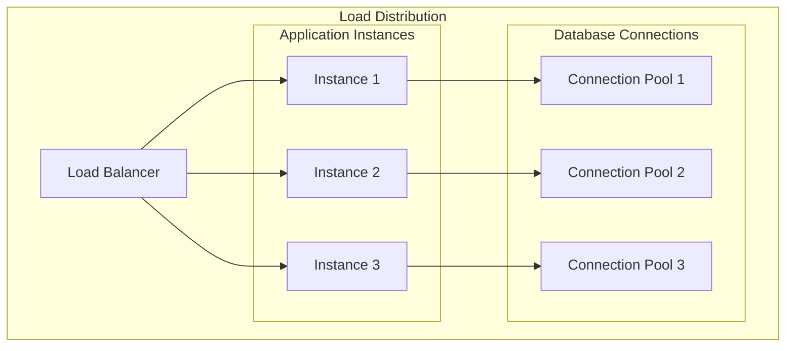

## Error Handling Architecture

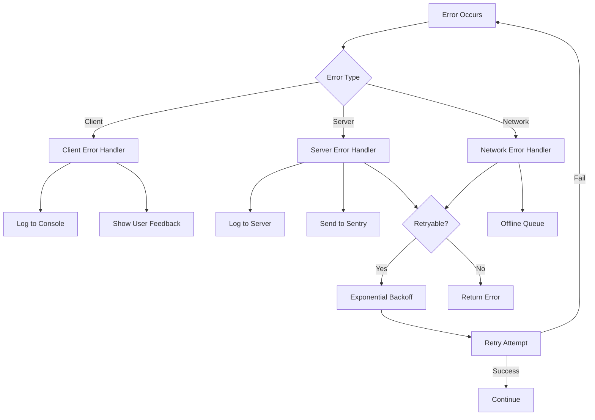

## Development Workflow

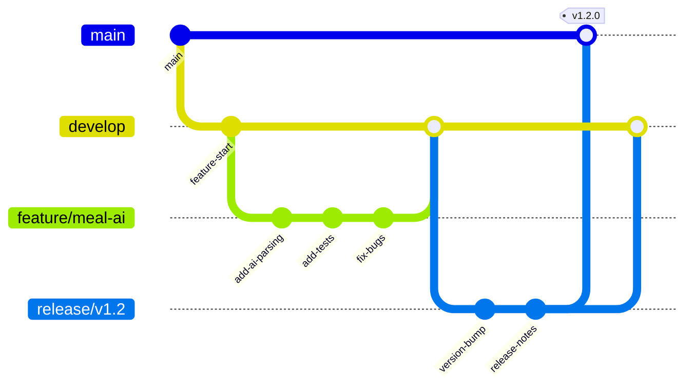

## Monitoring Architecture

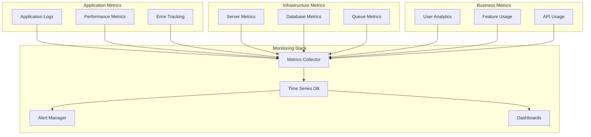

## Scalability Considerations

### Horizontal Scaling

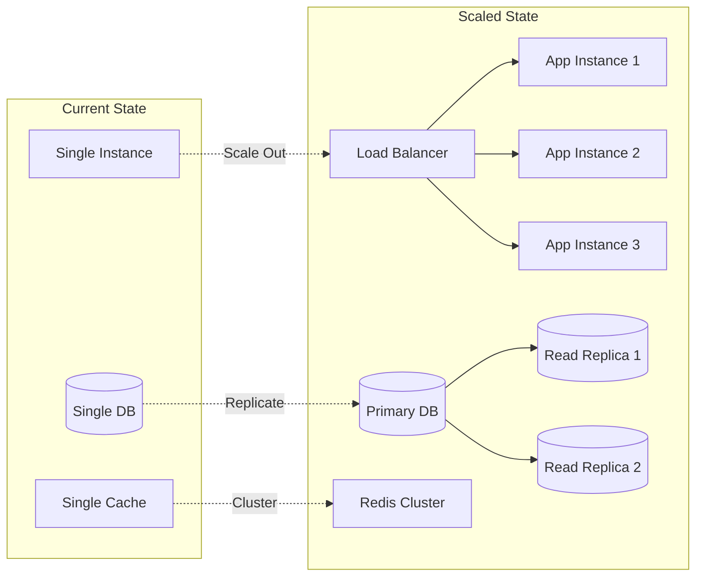

### Database Sharding Strategy

```mermaid
graph TD
    subgraph "Sharding by User ID"
        ROUTER[Shard Router]
        
        subgraph "Shard 1"
            DB1[(Users 0-999999)]
        end
        
        subgraph "Shard 2"
            DB2[(Users 1000000-1999999)]
        end
        
        subgraph "Shard 3"
            DB3[(Users 2000000-2999999)]
        end
    end
    
    REQUEST[User Request] --> ROUTER
    ROUTER -->|Hash(UserID)| DB1
    ROUTER -->|Hash(UserID)| DB2
    ROUTER -->|Hash(UserID)| DB3
```

## Technology Stack Summary

### Frontend
- **Framework**: Next.js 15.4.1 (App Router)
- **UI Library**: React 18
- **Styling**: Tailwind CSS v4
- **State Management**: React Query + tRPC
- **Forms**: React Hook Form + Zod
- **Components**: Radix UI + Custom

### Backend
- **Runtime**: Node.js 20 LTS
- **API**: tRPC v11
- **Authentication**: Better Auth v1.2.9
- **Database**: PostgreSQL 15 + Drizzle ORM
- **Caching**: Redis 7
- **Queue**: BullMQ
- **File Storage**: S3-compatible

### Infrastructure
- **Hosting**: Vercel (Edge Functions)
- **Database**: Vercel Postgres / Supabase
- **CDN**: Vercel Edge Network
- **Monitoring**: Sentry + Vercel Analytics
- **CI/CD**: GitHub Actions

### External Services
- **AI**: OpenAI GPT-4
- **Email**: SendGrid / Resend
- **OAuth**: GitHub, Google
- **Analytics**: PostHog