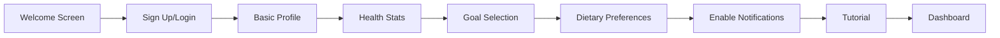
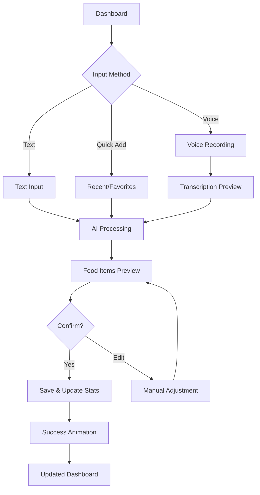
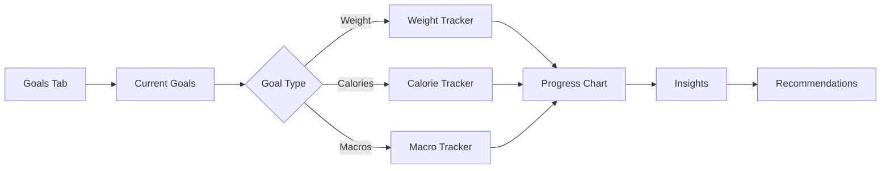

# NutriCoach v2 Design System & UI Flow

## Design Philosophy

### Core Principles

1. **Conversational Simplicity**
   - The interface should feel as natural as talking to a nutrition coach
   - Minimize cognitive load with clear, single-purpose screens
   - Progressive disclosure of complex features

2. **Trust Through Transparency**
   - Show AI confidence levels when parsing meals
   - Clear data sources and calculations
   - Easy editing and correction mechanisms

3. **Motivational Progress**
   - Celebrate small wins and milestones
   - Visual progress indicators everywhere
   - Positive reinforcement over negative feedback

4. **Mobile-First Efficiency**
   - Thumb-friendly touch targets (minimum 44px)
   - Bottom navigation for easy reach
   - Gesture-based interactions where appropriate

5. **Inclusive Accessibility**
   - WCAG 2.1 AA compliance
   - High contrast ratios (4.5:1 minimum)
   - Screen reader optimized
   - Voice-first options for all actions

## Visual Design Language

### Color System

```css
/* Primary Palette */
--primary-green: #10b981; /* Success, positive actions */
--primary-blue: #3b82f6; /* Primary actions, links */
--primary-purple: #8b5cf6; /* Premium features, insights */

/* Semantic Colors */
--success: #10b981;
--warning: #f59e0b;
--error: #ef4444;
--info: #3b82f6;

/* Neutral Scale */
--gray-50: #f9fafb;
--gray-100: #f3f4f6;
--gray-200: #e5e7eb;
--gray-300: #d1d5db;
--gray-400: #9ca3af;
--gray-500: #6b7280;
--gray-600: #4b5563;
--gray-700: #374151;
--gray-800: #1f2937;
--gray-900: #111827;

/* Background Colors */
--bg-primary: #ffffff;
--bg-secondary: #f9fafb;
--bg-tertiary: #f3f4f6;

/* Macro Colors */
--protein: #ec4899; /* Pink */
--carbs: #f59e0b; /* Amber */
--fat: #3b82f6; /* Blue */
--fiber: #10b981; /* Green */
```

### Typography

```css
/* Font Family */
--font-sans:
  -apple-system, BlinkMacSystemFont, "Inter", "Segoe UI", Roboto, sans-serif;
--font-mono: "SF Mono", "Monaco", "Inconsolata", monospace;

/* Font Sizes */
--text-xs: 0.75rem; /* 12px */
--text-sm: 0.875rem; /* 14px */
--text-base: 1rem; /* 16px */
--text-lg: 1.125rem; /* 18px */
--text-xl: 1.25rem; /* 20px */
--text-2xl: 1.5rem; /* 24px */
--text-3xl: 1.875rem; /* 30px */
--text-4xl: 2.25rem; /* 36px */

/* Font Weights */
--font-normal: 400;
--font-medium: 500;
--font-semibold: 600;
--font-bold: 700;

/* Line Heights */
--leading-tight: 1.25;
--leading-normal: 1.5;
--leading-relaxed: 1.75;
```

### Spacing System

```css
/* 8px base unit */
--space-0: 0;
--space-1: 0.25rem; /* 4px */
--space-2: 0.5rem; /* 8px */
--space-3: 0.75rem; /* 12px */
--space-4: 1rem; /* 16px */
--space-5: 1.25rem; /* 20px */
--space-6: 1.5rem; /* 24px */
--space-8: 2rem; /* 32px */
--space-10: 2.5rem; /* 40px */
--space-12: 3rem; /* 48px */
--space-16: 4rem; /* 64px */
```

### Border Radius

```css
--radius-sm: 0.25rem; /* 4px */
--radius-md: 0.5rem; /* 8px */
--radius-lg: 0.75rem; /* 12px */
--radius-xl: 1rem; /* 16px */
--radius-2xl: 1.5rem; /* 24px */
--radius-full: 9999px; /* Circular */
```

### Shadows

```css
--shadow-sm: 0 1px 2px 0 rgb(0 0 0 / 0.05);
--shadow-md: 0 4px 6px -1px rgb(0 0 0 / 0.1);
--shadow-lg: 0 10px 15px -3px rgb(0 0 0 / 0.1);
--shadow-xl: 0 20px 25px -5px rgb(0 0 0 / 0.1);
```

## Component Library

### 1. Input Components

#### Voice Input Button

```css
.voice-input-button {
  width: 64px;
  height: 64px;
  border-radius: var(--radius-full);
  background: var(--primary-blue);
  color: white;
  box-shadow: var(--shadow-lg);
  transition: all 0.2s ease;
}

.voice-input-button:active {
  transform: scale(0.95);
  background: var(--primary-green);
}

.voice-input-button.recording {
  animation: pulse 1.5s infinite;
  background: var(--error);
}

@keyframes pulse {
  0% {
    box-shadow: 0 0 0 0 rgba(239, 68, 68, 0.7);
  }
  70% {
    box-shadow: 0 0 0 20px rgba(239, 68, 68, 0);
  }
  100% {
    box-shadow: 0 0 0 0 rgba(239, 68, 68, 0);
  }
}
```

#### Natural Language Input

```css
.meal-input {
  width: 100%;
  min-height: 120px;
  padding: var(--space-4);
  border: 2px solid var(--gray-200);
  border-radius: var(--radius-xl);
  font-size: var(--text-lg);
  line-height: var(--leading-relaxed);
  resize: none;
  transition: border-color 0.2s ease;
}

.meal-input:focus {
  outline: none;
  border-color: var(--primary-blue);
  box-shadow: 0 0 0 3px rgba(59, 130, 246, 0.1);
}

.meal-input::placeholder {
  color: var(--gray-400);
  font-style: italic;
}
```

### 2. Card Components

#### Dashboard Stat Card

```css
.stat-card {
  background: var(--bg-primary);
  border-radius: var(--radius-xl);
  padding: var(--space-6);
  box-shadow: var(--shadow-md);
  position: relative;
  overflow: hidden;
}

.stat-card::before {
  content: "";
  position: absolute;
  top: 0;
  left: 0;
  right: 0;
  height: 4px;
  background: linear-gradient(90deg, var(--primary-blue), var(--primary-green));
}

.stat-value {
  font-size: var(--text-3xl);
  font-weight: var(--font-bold);
  color: var(--gray-900);
  margin-bottom: var(--space-1);
}

.stat-label {
  font-size: var(--text-sm);
  color: var(--gray-500);
  text-transform: uppercase;
  letter-spacing: 0.05em;
}

.stat-progress {
  margin-top: var(--space-4);
  height: 8px;
  background: var(--gray-100);
  border-radius: var(--radius-full);
  overflow: hidden;
}

.stat-progress-bar {
  height: 100%;
  background: linear-gradient(90deg, var(--primary-blue), var(--primary-green));
  border-radius: var(--radius-full);
  transition: width 0.3s ease;
}
```

#### Food Item Card

```css
.food-card {
  display: flex;
  align-items: center;
  gap: var(--space-4);
  padding: var(--space-4);
  background: var(--bg-primary);
  border-radius: var(--radius-lg);
  box-shadow: var(--shadow-sm);
  transition: all 0.2s ease;
}

.food-card:hover {
  box-shadow: var(--shadow-md);
  transform: translateY(-2px);
}

.food-icon {
  width: 48px;
  height: 48px;
  border-radius: var(--radius-md);
  background: var(--gray-100);
  display: flex;
  align-items: center;
  justify-content: center;
  font-size: 24px;
}

.food-details {
  flex: 1;
}

.food-name {
  font-weight: var(--font-semibold);
  color: var(--gray-900);
  margin-bottom: var(--space-1);
}

.food-meta {
  font-size: var(--text-sm);
  color: var(--gray-500);
}

.food-calories {
  font-weight: var(--font-bold);
  color: var(--primary-blue);
}
```

### 3. Charts & Visualizations

#### Macro Distribution Ring

```css
.macro-ring {
  width: 200px;
  height: 200px;
  position: relative;
}

.macro-ring-svg {
  transform: rotate(-90deg);
}

.macro-ring-background {
  fill: none;
  stroke: var(--gray-100);
  stroke-width: 20;
}

.macro-ring-protein {
  fill: none;
  stroke: var(--protein);
  stroke-width: 20;
  stroke-linecap: round;
  transition: stroke-dasharray 0.5s ease;
}

.macro-ring-carbs {
  fill: none;
  stroke: var(--carbs);
  stroke-width: 20;
  stroke-linecap: round;
  transition: stroke-dasharray 0.5s ease;
}

.macro-ring-fat {
  fill: none;
  stroke: var(--fat);
  stroke-width: 20;
  stroke-linecap: round;
  transition: stroke-dasharray 0.5s ease;
}

.macro-ring-center {
  position: absolute;
  top: 50%;
  left: 50%;
  transform: translate(-50%, -50%);
  text-align: center;
}

.macro-ring-calories {
  font-size: var(--text-2xl);
  font-weight: var(--font-bold);
  color: var(--gray-900);
}

.macro-ring-label {
  font-size: var(--text-sm);
  color: var(--gray-500);
}
```

### 4. Navigation

#### Bottom Navigation (Mobile)

```css
.bottom-nav {
  position: fixed;
  bottom: 0;
  left: 0;
  right: 0;
  background: var(--bg-primary);
  border-top: 1px solid var(--gray-200);
  padding: var(--space-2) 0;
  display: flex;
  justify-content: space-around;
  z-index: 50;
}

.nav-item {
  flex: 1;
  display: flex;
  flex-direction: column;
  align-items: center;
  gap: var(--space-1);
  padding: var(--space-2);
  color: var(--gray-400);
  transition: color 0.2s ease;
}

.nav-item.active {
  color: var(--primary-blue);
}

.nav-icon {
  width: 24px;
  height: 24px;
}

.nav-label {
  font-size: var(--text-xs);
  font-weight: var(--font-medium);
}

/* Add meal FAB */
.fab-add-meal {
  position: fixed;
  bottom: 80px;
  right: var(--space-4);
  width: 56px;
  height: 56px;
  border-radius: var(--radius-full);
  background: var(--primary-blue);
  color: white;
  box-shadow: var(--shadow-lg);
  display: flex;
  align-items: center;
  justify-content: center;
  transition: all 0.2s ease;
  z-index: 40;
}

.fab-add-meal:hover {
  transform: scale(1.05);
  box-shadow: var(--shadow-xl);
}
```

### 5. Feedback & Loading States

#### AI Processing Indicator

```css
.ai-processing {
  display: flex;
  align-items: center;
  gap: var(--space-3);
  padding: var(--space-4);
  background: var(--gray-50);
  border-radius: var(--radius-lg);
  margin: var(--space-4) 0;
}

.ai-processing-icon {
  width: 32px;
  height: 32px;
  animation: rotate 2s linear infinite;
}

@keyframes rotate {
  from {
    transform: rotate(0deg);
  }
  to {
    transform: rotate(360deg);
  }
}

.ai-processing-text {
  flex: 1;
  color: var(--gray-600);
  font-size: var(--text-sm);
}

.ai-confidence {
  display: flex;
  align-items: center;
  gap: var(--space-2);
  font-size: var(--text-sm);
}

.ai-confidence-bar {
  width: 60px;
  height: 4px;
  background: var(--gray-200);
  border-radius: var(--radius-full);
  overflow: hidden;
}

.ai-confidence-fill {
  height: 100%;
  background: var(--primary-green);
  transition: width 0.3s ease;
}
```

#### Success Animation

```css
.success-checkmark {
  width: 80px;
  height: 80px;
  margin: 0 auto;
}

.success-checkmark-circle {
  stroke-dasharray: 166;
  stroke-dashoffset: 166;
  stroke-width: 2;
  stroke-miterlimit: 10;
  stroke: var(--success);
  fill: none;
  animation: stroke 0.6s cubic-bezier(0.65, 0, 0.45, 1) forwards;
}

.success-checkmark-check {
  transform-origin: 50% 50%;
  stroke-dasharray: 48;
  stroke-dashoffset: 48;
  stroke: var(--success);
  fill: none;
  animation: stroke 0.3s cubic-bezier(0.65, 0, 0.45, 1) 0.8s forwards;
}

@keyframes stroke {
  100% {
    stroke-dashoffset: 0;
  }
}
```

## User Flows

### 1. Onboarding Flow



**Design Considerations:**

- Progressive disclosure: Only ask for essential info upfront
- Visual progress indicator showing steps
- Skip options for non-essential steps
- Celebration animation on completion

### 2. Meal Logging Flow



**Design Considerations:**

- Large, thumb-friendly input areas
- Clear AI processing feedback
- Easy editing before confirmation
- Instant visual feedback on dashboard

### 3. Goal Tracking Flow



**Design Considerations:**

- Visual progress indicators
- Milestone celebrations
- Trend analysis with simple language
- Actionable recommendations

## Interaction Patterns

### 1. Gesture Support

- **Swipe Right**: Mark meal as favorite
- **Swipe Left**: Delete/Remove item
- **Pull to Refresh**: Update dashboard data
- **Long Press**: Quick edit options
- **Pinch**: Zoom timeline views

### 2. Micro-interactions

```css
/* Button Press */
.button {
  transition: all 0.2s ease;
  transform: translateY(0);
}

.button:active {
  transform: translateY(1px) scale(0.98);
}

/* Toggle Switch */
.toggle {
  position: relative;
  width: 48px;
  height: 24px;
  background: var(--gray-300);
  border-radius: var(--radius-full);
  transition: background 0.3s ease;
}

.toggle.active {
  background: var(--primary-green);
}

.toggle-thumb {
  position: absolute;
  width: 20px;
  height: 20px;
  background: white;
  border-radius: var(--radius-full);
  top: 2px;
  left: 2px;
  transition: transform 0.3s ease;
  box-shadow: var(--shadow-sm);
}

.toggle.active .toggle-thumb {
  transform: translateX(24px);
}
```

### 3. Loading States

```css
/* Skeleton Loading */
.skeleton {
  background: linear-gradient(
    90deg,
    var(--gray-200) 25%,
    var(--gray-100) 50%,
    var(--gray-200) 75%
  );
  background-size: 200% 100%;
  animation: loading 1.5s infinite;
}

@keyframes loading {
  0% {
    background-position: 200% 0;
  }
  100% {
    background-position: -200% 0;
  }
}

/* Shimmer Effect */
.shimmer {
  position: relative;
  overflow: hidden;
}

.shimmer::after {
  content: "";
  position: absolute;
  top: 0;
  right: 0;
  bottom: 0;
  left: 0;
  transform: translateX(-100%);
  background: linear-gradient(
    90deg,
    rgba(255, 255, 255, 0) 0,
    rgba(255, 255, 255, 0.2) 20%,
    rgba(255, 255, 255, 0.5) 60%,
    rgba(255, 255, 255, 0)
  );
  animation: shimmer 2s infinite;
}

@keyframes shimmer {
  100% {
    transform: translateX(100%);
  }
}
```

## Accessibility Guidelines

### 1. Color Contrast

- Text on background: 4.5:1 minimum
- Large text (18px+): 3:1 minimum
- Interactive elements: 3:1 minimum
- Provide color-blind friendly alternatives

### 2. Touch Targets

- Minimum size: 44x44px
- Spacing between targets: 8px minimum
- Grouped actions for related items
- Gesture alternatives for all actions

### 3. Screen Reader Support

```html
<!-- Proper ARIA labels -->
<button aria-label="Record voice input" class="voice-input-button">
  <svg aria-hidden="true">...</svg>
</button>

<!-- Live regions for dynamic content -->
<div aria-live="polite" aria-atomic="true">
  <p class="ai-processing-text">Processing your meal...</p>
</div>

<!-- Semantic HTML -->
<nav aria-label="Main navigation">
  <ul role="list">
    <li><a href="/dashboard" aria-current="page">Dashboard</a></li>
    <li><a href="/meals">Meals</a></li>
  </ul>
</nav>
```

### 4. Keyboard Navigation

- All interactive elements reachable via Tab
- Clear focus indicators
- Escape key closes modals
- Enter/Space activates buttons

## Motion & Animation

### 1. Timing Functions

```css
--ease-in: cubic-bezier(0.4, 0, 1, 1);
--ease-out: cubic-bezier(0, 0, 0.2, 1);
--ease-in-out: cubic-bezier(0.4, 0, 0.2, 1);
--spring: cubic-bezier(0.5, 1.5, 0.5, 1);
```

### 2. Duration Guidelines

- Micro-interactions: 100-200ms
- Page transitions: 200-300ms
- Complex animations: 300-500ms
- Respect `prefers-reduced-motion`

### 3. Performance

```css
/* Use transform and opacity for animations */
.slide-in {
  transform: translateY(20px);
  opacity: 0;
  transition:
    transform 0.3s var(--ease-out),
    opacity 0.3s var(--ease-out);
}

.slide-in.active {
  transform: translateY(0);
  opacity: 1;
}

/* Hardware acceleration */
.animated {
  will-change: transform;
  transform: translateZ(0);
}
```

## Responsive Breakpoints

```css
/* Mobile First */
--screen-sm: 640px; /* Small tablets */
--screen-md: 768px; /* Tablets */
--screen-lg: 1024px; /* Desktop */
--screen-xl: 1280px; /* Large desktop */

/* Usage */
@media (min-width: 768px) {
  .container {
    max-width: 768px;
    padding: var(--space-8);
  }
}
```

## Dark Mode Support

```css
/* Automatic dark mode */
@media (prefers-color-scheme: dark) {
  :root {
    --bg-primary: #0f172a;
    --bg-secondary: #1e293b;
    --bg-tertiary: #334155;
    --text-primary: #f1f5f9;
    --text-secondary: #cbd5e1;
    /* Adjust other colors accordingly */
  }
}

/* Manual toggle class */
.dark {
  --bg-primary: #0f172a;
  --bg-secondary: #1e293b;
  /* ... rest of dark theme */
}
```

## Implementation Priority

### Phase 1: Core Experience

1. Onboarding flow
2. Text-based meal input
3. Basic dashboard
4. Simple food list

### Phase 2: Enhanced Features

1. Voice input
2. AI confidence indicators
3. Charts and visualizations
4. Goal tracking

### Phase 3: Delight & Polish

1. Micro-interactions
2. Success animations
3. Advanced gestures
4. Personalization

## Design Tokens Export

```javascript
// design-tokens.js
export const tokens = {
  colors: {
    primary: {
      green: "#10B981",
      blue: "#3B82F6",
      purple: "#8B5CF6",
    },
    semantic: {
      success: "#10B981",
      warning: "#F59E0B",
      error: "#EF4444",
      info: "#3B82F6",
    },
    gray: {
      50: "#F9FAFB",
      100: "#F3F4F6",
      // ... etc
    },
  },
  spacing: {
    0: "0",
    1: "0.25rem",
    2: "0.5rem",
    // ... etc
  },
  typography: {
    fontFamily: {
      sans: '-apple-system, BlinkMacSystemFont, "Inter", "Segoe UI", Roboto, sans-serif',
      mono: '"SF Mono", "Monaco", "Inconsolata", monospace',
    },
    fontSize: {
      xs: "0.75rem",
      sm: "0.875rem",
      // ... etc
    },
  },
};
```

## Figma/Sketch Libraries

### Component Organization

```
📁 NutriCoach Design System
  📁 1. Foundations
    📄 Colors
    📄 Typography
    📄 Spacing & Grid
    📄 Shadows & Effects
  📁 2. Components
    📁 Inputs
      📄 Text Input
      📄 Voice Input
      📄 Toggle
      📄 Select
    📁 Cards
      📄 Stat Card
      📄 Food Card
      📄 Goal Card
    📁 Navigation
      📄 Bottom Nav
      📄 Tab Bar
      📄 FAB
    📁 Feedback
      📄 Loading States
      📄 Success States
      📄 Error States
  📁 3. Patterns
    📄 Onboarding Flow
    📄 Meal Input Flow
    📄 Dashboard Layout
  📁 4. Templates
    📄 Mobile Screens
    📄 Tablet Screens
    📄 Desktop Screens
```

---

This design system provides a comprehensive foundation for building NutriCoach v2 with a focus on usability, accessibility, and delightful user experience. The conversational interface approach combined with clear visual feedback creates an intuitive nutrition tracking experience that feels effortless and engaging.
